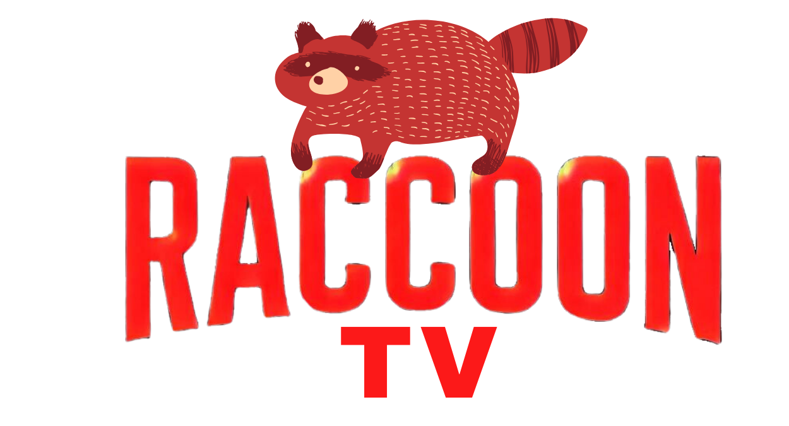
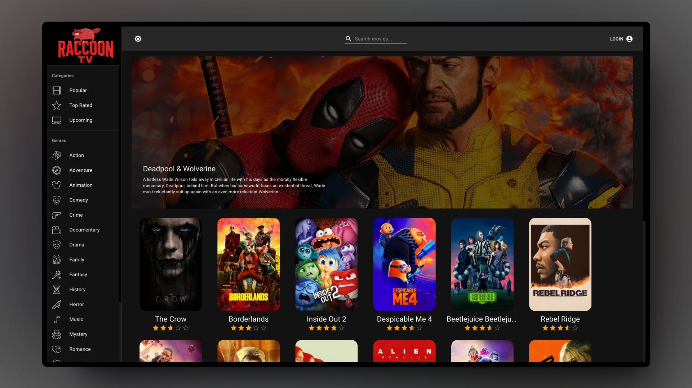
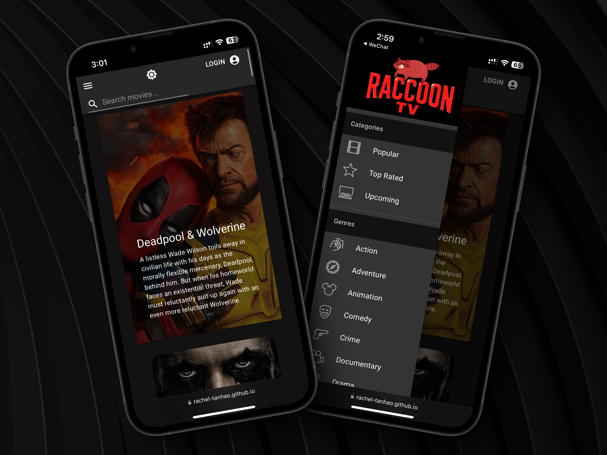
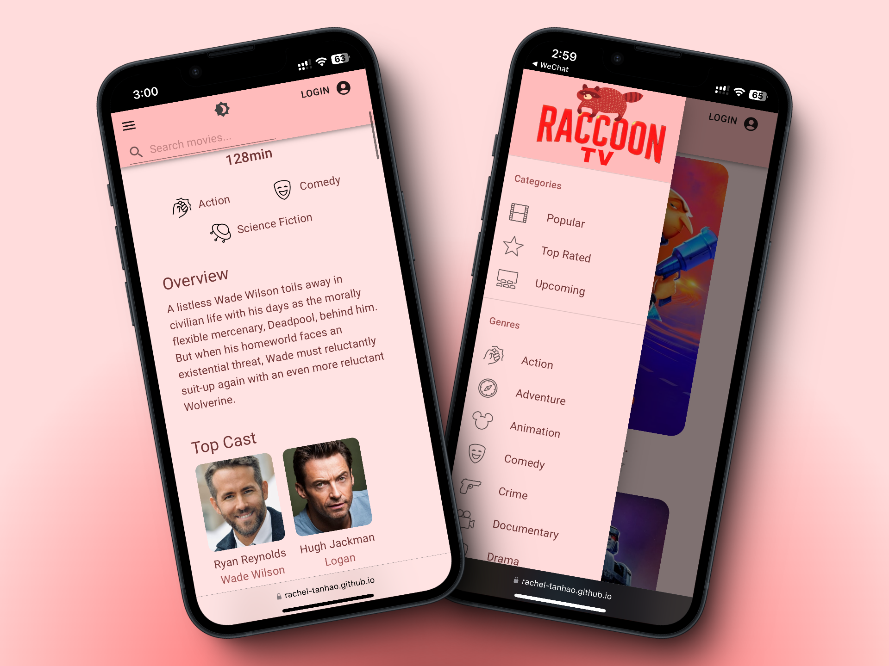

# RaccoonTV - The Movie App 🎬🍿


<div align="center">
  
</div>

**Hey there, movie lovers!** It’s me, your sneaky but oh-so-friendly neighborhood raccoon! 🦝 I’ve built **RaccoonTV**,  a Netflix-inspired full-stack movie app that does pretty much everything Netflix does—except, you know, stream full-length movies (ah, copyrights! 💸). What can I say? I’m just a humble raccoon with empty pockets. 👉👈  But hey, you can still check out trailers! 

On the tech side, RaccoonTV comes fully equipped with user authentication, profile management (build your own watchlist and favorites!), and even an AI Voice Assistant to navigate the app hands-free—how cool is that? 🎬✨


## 📝 Why Did I Build This?

Well, let me tell you—I'm a raccoon with a huge love for Netflix and an even bigger dream of seeing myself on the big screen. But, surprise, surprise, no casting director wanted a raccoon. Like, excuse me? Who wouldn’t want this fluff on their screen?! So one day, I had a brilliant idea: if I can’t be an actor, I’ll just be the **logo**! 💥 And boom—RaccoonTV was born. I built my own Netflix (!) and slapped my face right on the logo. Woo-hoo! 😎




## 🌐 Live Demo

  Hey! Check out my app in action 🍿: [**RaccoonTV - Live Demo**](https://rachel-tanhao.github.io/RaccoonTV-Movie-App/) 




<!--  -->


### ✨ Key Features

- **Real-time Data**: Efficient caching and data fetching with **Redux Toolkit Query**, ensuring up-to-date movie information 🔄
- **Optimized Search**: Fast search powered by **React** and **Redux Toolkit** for smooth performance 🔍
- **Comprehensive Movie Profiles**: Detailed movie info, including cast, ratings, and trailers, fetched via **Axios** and managed with **Redux** 🎥
- **Personalized User Experience**: Manage your watchlist and favorites with **user authentication** and **profile management** using **TMDB's API** 🔐
- **Voice-Controlled Navigation**: Hands-free browsing and search powered by **Alan AI** 🗣️


## 📖 Table of Contents

- [RaccoonTV - The Movie App 🎬🍿](#raccoontv---the-movie-app-)
  - [📝 Why Did I Build This?](#-why-did-i-build-this)
  - [🌐 Live Demo](#-live-demo)
    - [✨ Key Features](#-key-features)
  - [📖 Table of Contents](#-table-of-contents)
  - [🛠️ The Tech Behind RaccoonTV](#️-the-tech-behind-raccoontv)
  - [🔌 API Calls](#-api-calls)
  - [🛠️ Setup Project](#️-setup-project)
    - [🍴 Prerequisites](#-prerequisites)
    - [🚀 Installation](#-installation)
  - [🔍 Usage](#-usage)
  - [🔒 Environment Variables](#-environment-variables)
  - [🤝 Contributing](#-contributing)
  - [📫 Contact Me](#-contact-me)
  - [📄 License](#-license)


## 🛠️ The Tech Behind RaccoonTV

- **Framework**: Built with **React** ⚛️
- **State Management**: Powered by **Redux Toolkit** ⚙️
- **Styling**: Material-UI for that sleek look 💅
- **Voice Control**: Integrated with **Alan AI** for hands-free navigation—just speak and explore! 🗣️
- **API Integration**: **Redux Toolkit Query** for seamless data fetching 🔄
- **HTTP Client**: **Axios** for flexible API requests 🌐
- **Data**: TMDB API for comprehensive movie information 🍿


## 🔌 API Calls

I may be a raccoon, but when it comes to fetching data, I’ve got some serious connections! Using the **TMDB API**, I’ve integrated all the essential calls to keep your movie experience top-notch. Here’s what you can expect:

- **Get Genres** – Because, duh, who doesn’t want to filter by genre? 🎭
- **Get Movies** (by type, search, category, or genre) – Whether you’re feeling adventurous or already know what you want, I’ve got you covered.
- **Get Movie Details** (including videos and credits) – Everything you need to know about a movie, from cast to trailers. 🎥
- **Get Movie Recommendations** – Oh yeah, I’m all about serving up those “you might also like” suggestions.
- **Get Actor Details** – Want to stalk—I mean, follow—your favorite actors? I’ve got the deets. 🕵️‍♀️
- **Get Movies by Actor ID** – Find every movie your favorite star has graced.
- **Get User-Specific Lists** (favorites and watchlist) – Keep track of all your must-watch films!
- **Authentication Token Request** – I like to keep things secure, so we start with this. 🔒
- **Create Session ID** – You need access, I give you access. Simple as that. 🔑

These API calls are primarily defined in the **TMDB service file** (src/services/TMDB.js)—because even raccoons like to keep things organized. 🗄️


## 🛠️ Setup Project

### 🍴 Prerequisites

Before you dive into RaccoonTV, make sure you have the following:

- **Node.js** 🌳
- **npm** 🛠️
- **TMDB API Key** 🔑
- **Alan AI API Key** 🗣️

### 🚀 Installation

Ready to roll? Follow these steps:

1. **Clone the repository**:
   ```bash
   git clone https://github.com/rachel-tanhaow/RaccoonTV-Movie-App.git
   cd RaccoonTV-Movie-App
   ```

2. **Install dependencies**:
   ```bash
   cd client
   npm install
   ```

3. **Set up environment variables** (details below).

4. **Start the application**:
   ```bash
   npm start
   ```

## 🔍 Usage

Once you’ve got the app running, head over to **http://localhost:3000** (or a similar address - check your terminal). You can start browsing movies, searching for titles, and using voice commands to explore the app. 🎙️

## 🔒 Environment Variables

To get this up and running, you'll need to add your API keys. In the `client` directory, create a `.env` file and include the following:

```
REACT_APP_TMDB_KEY=your_tmdb_api_key
REACT_APP_ALAN_SDK_KEY=your_alan_ai_sdk_key
```

## 🤝 Contributing

Contributions from fellow movie-loving raccoons are welcome! 🦝 If you’ve got an idea or feature to add, feel free to:

1. **Fork the repo** 🌀
2. **Create your feature branch**:
   ```bash
   git checkout -b feature/AmazingFeature
   ```
3. **Commit your changes**:
   ```bash
   git commit -m 'Add some AmazingFeature'
   ```
4. **Push to the branch**:
   ```bash
   git push origin feature/AmazingFeature
   ```
5. **Open a Pull Request**!


## 📫 Contact Me

Got questions or feedback? Let’s chat! 📧

Hit me up at: **tanhaosmail@gmail.com**. 


## 📄 License

This project is licensed under the **MIT License**. Check out the [LICENSE](LICENSE) file for more details.